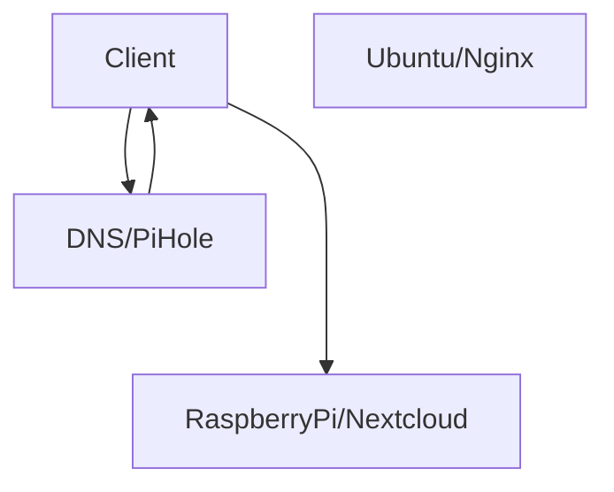
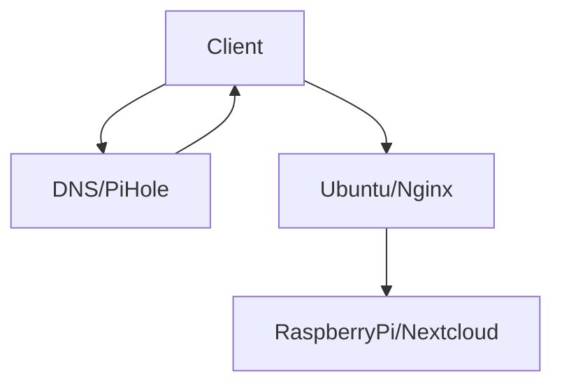

My home server needed an upgrade. The Raspberry Pi served excellently as a small energy efficient home server running Samba, Pihole, Photoprism which I later swapped out in favor of Nextcloud, and a couple other services. The pi was working overtime to keep up, all while there was an old unused laptop lying around. It's time for an upgrade! This post focuses primarily on the Nextcloud migration as most of the other services aren't as data/config dependent (for example, most of the Samba shares are on an external drive anyways) and assumes Pihole is used as a local DNS to translate.  `http://local.network.location` to `http://1.2.3.4`

## Installing the server OS

Server workload demands server OS. Not necessarily, but there's no point running desktop software if the machine is going to lie in a corner as a server. I went with the latest [Ubuntu server LTS](https://ubuntu.com/download/server) as I'm comfortable with the ubuntu command line. Ubuntu has a [tutorial](https://ubuntu.com/tutorials/create-a-usb-stick-on-windows) on how to do this in Windows.

Reboot into the boot media (USB stick) by holding F12 during startup and follow the steps on screen to set up the OS.

## Install SSH

The server is probably going to sit in a corner somewhere out of sight and accessed by another device with nicer peripherals. An SSH server is needed.
```sh
sudo apt update
sudo apt install -y openssh-server
```

## Choose your server

The server will need to *serve*. Apache comes pre-installed. I used Caddy for the simplicity of automatic HTTPS in my Raspberry Pi setup. Nginx is very popular and is more widely used in industry, and it would be good to learn how to set up HTTPS without Caddy. Nginx it is.

Apache will need to be removed first, as it will be bound to the HTTP ports. It was either `apache2` or `httpd`. Then, `nginx` can be installed
```sh
sudo apt install -y nginx
```

## Optional: Disable suspend on lid close

Edit `/etc/systemd/logind.conf` and set the following:
```
HandleLidSwitch=ignore
LidSwitchIgnoreInhibited=no
```

Then restart logind
```sh
sudo service systemd-logind restart
```

## Milestone: Use new server as entry point

Nginx is installed and we want to route trafic to it. The current network state looks as follows: a client accessing nextcloud asks PiHole for the address of the Nextcloud server. It resolves the local IP address of the Raspberry Pi, which hosts the Nextcloud instance.



The new server can front the nextcloud service easily by reverse proxying to the raspberry pi, after which we can update the DNS records in PiHole to point to the address of the new server when looking for the Nextcloud instance.



### Create the reverse proxy config in Nginx

Add a new config to `/etc/nginx/sites-available/` using your favourite editor. I'm using vim.

```sh
sudo vim /etc/nginx/sites-available/nextcloud
```

```
server {
       	server_name my.nextcloud.instance;

       	listen 80;
       	listen [::]:80;

       	location / {
       		proxy_pass http[s]://raspberry.pi:nextcloud_port;
		    include proxy_params;
       	}
}
```

### Enable the site in Nginx

Enable the site by linking it to `sites-enabled`.

```sh
sudo ln -s /etc/nginx/sites-available/nextcloud /etc/nginx/sites-enabled/
```

Restart nginx with `sudo systemctl restart nginx` and verify that it started without error with `sudo systemctl status nginx`.

### Update the DNS

Your local DNS can now point nextcloud to the address of your new server. Remember to use static local IPs for your servers so they don't change addresses when your router or server restarts.

### Let's Encrypt certificate

The nextcloud mobile client assumes HTTPS and my firefox configuration demands it. Therefore, it's necessary to have HTTPS set up, even though the server is only accessible in my local network. I got a cert by temporarily expoing this (currently empty) site to the open web to get a real certificate by forwarding ports 80 (HTTP) and 443 (HTTPS) and using [certbot](https://certbot.eff.org/) to get a Let's Encrypt certificate. Note that this requires a public domain name under your control and pointing to the public IP of the nginx server.

Installing a certificate using certbot was very simple. The CLI tool asks which of the enabled nginx sites to install certificates for and automatically installs the certificate and updates the nginx config.

If keeping the server online on the internet is desired, then that's all for this section. Otherwise, remember to remove this IP from the DNS in your public domain name and close the ports in your router.

## Quick Note

This migration will be somewhat complex--much moreso than a fresh install. A fresh install at this point would involve simply following any of the [linux installation guides](https://docs.nextcloud.com/server/latest/admin_manual/installation/source_installation.html) in the Nextcloud docs.

This migration involves an existing bare-metal Nextcloud instance served by Caddy using fast_cgi. It uses MySQL as the DB and RClone to back the files up to an offsite data store. The user data (files, photos, etc) are fortunately all stored in an external hard drive, so moving the data itself should be easy.

My goal is to use the [Nextcloud docker image](https://hub.docker.com/_/nextcloud/) with [watchtower](https://containrrr.dev/watchtower/) to automatically update the server and keep it isolated within a container. I also want to use Postgres.

## Postgresql setup

Install postgresql by running
```sh
sudo apt install postgresql
```

Enter the `psql` console
```sh
sudo -u postgres psql
```

Create database and user
```sql
CREATE USER nextcloud WITH PASSWORD 'your-password';
CREATE DATABASE nextcloud;
GRANT ALL PRIVILEGES ON DATABASE nextcloud TO nextcloud;
ALTER DATABASE nextcloud OWNER TO nextcloud;
```

Postgres by default will only accept local connections. The next goal is to use this Postgres instance instead of MySQL. Find the `listen_addresses` line in `/etc/postgresql/16/main/postgresql.conf` and add the *Postgres host's local network IP*. Alternatively, use `'*'` to listen from all interfaces--just make sure the postgres port isn't forwarded, lest there be open internet connections. 
```
listen_addresses = 'localhost,<this-device-local-ip>'
```

Now, add an entry to `/etc/postgresql/16/main/pg_hba.conf` to allow a *host* to access the *nextcloud* database using the *nextcloud* user if the host has the address *\<raspberry-pi-ip>* using the *scram-sha-256* authentication method.
```
host    nextcloud       nextcloud       <raspberry-pi-ip>          scram-sha-256
```

Now from the raspberry pi, the following command should spawn a postgresql console.
```
psql -h <postgres-host> -p <postgres-port> -U nextcloud nextcloud
```

## Redirecting Nextcloud to Postgres

First, make sure `php-pgsql` is installed. On the raspberry pi, there were some [extra steps](https://pimylifeup.com/raspberry-pi-latest-php/) to get PHP to install. Make sure that the PHP version is supported by your version of nextcloud. For my upgrade, I needed version 8.2.
```sh
sudo apt install php8.2-pgsql
```

Then put nextcloud into maintenance mode and use the built-in tool to swap databases.
```sh
# Go to nextcloud directory where the occ script is located
cd $NEXTCLOUD

# Enable maintenance mode
sudo -u www-data php ./occ maintenance:mode --on

# Run the tool to copy data and point to the postgres database.
# This will take a while.
sudo -u www-data php8.2 ./occ db:convert-type --port="<postgres-port>" pgsql nextcloud <postgres-host> nextcloud

# Disable maintenance mode
sudo -u www-data php ./occ maintenance:mode --off
```

Nextcloud should now be using postgres as the database. Confirm by checking `$NEXTCLOUD/config/config.php` that the `dbhost` is set to
```php
  'dbhost' => '192.168.4.2:5432',`
```

## Automatic drive mount and decryption

Given the storage constraints of the Raspberry Pi, my data is housed in a hard disk drive that is LUKS-encrypted. This is so that if someone broke into my house and stole my drive, the data would be inaccessible. I would strongly prefer not manually decrypting and mounting it if I need to restart my server.

First, create a mount point.

```sh
sudo mkdir /media/drive
```

Get the UUID of your device using the following command. The external drive typically shows up in the form `sda`, `sda1`, `sdb`, etc. The UUID will be used to create a unit file for the service that will decrypt the disk on startup.

```sh
sudo ls -al /dev/disk/by-uuid
```


### Decrypt unit

Create a systemd service to decrypt the drive using the UUID you found in the previous part. Notably in this service:
- The service only starts after the server has a network connection.
- The luks keyfile is piped from a script `/etc/luks/key.sh` which fetches it from a network location. This was done to avoid storing the keyfile in the Raspberry pi. If using an offline decryption key, `After` and `Requires` can be removed.
- Implementing `/etc/luks/key.sh` is an exercise left to the reader. Or just use cryptsetup with a local key file in `ExecStart`.

```sh
sudo vim /etc/systemd/system/net-luks-open.service
```
```
[Unit]
Description=Open encrypted data volume
After=network-online.target
Requires=network-online.target
StopWhenUnneeded=true

[Service]
Type=oneshot
ExecStart=/bin/sh -c '/etc/luks/key.sh | /sbin/cryptsetup -d - luksOpen /dev/disk/by-uuid/your-disk-uuid external_hdd'
RemainAfterExit=yes
ExecStop=/sbin/cryptsetup luksClose /dev/mapper/external_hdd

[Install]
RequiredBy=media-drive.mount
```

### Mount unit

Name this after the mount point defined earlier (`media/drive`), substituting slashes for dashes.
```sh
sudo vim /etc/systemd/system/media-drive.mount
```
```
[Unit]
Requires=net-luks-open.service
After=net-luks-open.service

[Mount]
What=/dev/mapper/external_hdd
Where=/media/drive
Type=ext4
Options=defaults,noatime,_netdev

[Install]
WantedBy=multi-user.target
```

### Enable service

```sh
sudo systemctl daemon-reload
sudo systemctl enable media-drive.mount
sudo systemctl start media-drive.mount

# Should show contents of the drive
ls /media/drive
```

## Nextcloud instance setup

Finally, all the data is in place! Let's run the nextcloud image!
```yaml
# docker-compose.yml
volumes:
  nextcloud:
    name: nextcloud-application
    driver: local
    driver_opts:
      device: /media/drive/nextcloud
      o: bind
      type: local
  database:
    name: nextcloud-database

services:

  nextcloud:
    container_name: nextcloud # need consistent name for docker exec in crontab.
    image: nextcloud:29.0.8 # make sure this is the same version as the existing installation. I upgraded this too far, so I can't use :stable (29.0.7) with watchtower until it catches up.
    ports:
      - 80:80
    restart: always
    links:
      - redis
      - db
    volumes:
      - nextcloud:/var/www/html/
    environment:
      - REDIS_HOST=redis
      - POSTGRES_HOST=db
      - POSTGRES_DB=nextcloud
      - POSTGRES_USER=nextcloud
      - POSTGRES_PASSWORD=<your-password>

  db:
    image: postgres:16.3
    environment:
      - POSTGRES_DB=nextcloud
      - POSTGRES_USER=nextcloud
      - POSTGRES_PASSWORD=<your-password>
    volumes:
      - database:/var/lib/postgresql/data

  redis:
    image: redis
    restart: always
    command: redis-server
```

Start the containers by running `docker compose up` in the directory with the `docker-compose.yml` file.

### Restore DB from dump

I originally planned to have the database running in the host, but later decided I wanted the container to be fully isolated. Thus, I had to migrate the database (again). Dump the postgres db, then copy the DB dump into the docker container and run the migration as follows.
```sh
# Dump the db into a sql file.
sudo -u postgres pg_dump nextcloud > dump.sql
# copy the file into docker
docker cp dump.sql <postgresContainerId>:/dump.sql
# spawn a shell inside the container
docker exec -it <postgresContainerId> sh
# Run the migration
psql -U nextcloud -f dump.sql
```
Find the ID by running `docker ps`, or just name it like the nextcloud container.

### Backup Script

While we configure cron, we might as well setup the backup scripts. I back up my drive to S3 deep glacier as an offsite backup using a script that looks as follows:

```sh
#!/bin/sh

# Config
ncDataDir=/media/drive/nextcloud/data
bucket='rclone-config-name:aws-bucket-name'
rcloneSyncOptions='--update --use-server-modtime'

# The NC directory looks something like this
# nextcloud
# |-user1
# ||-files
# |-user2
# ||-files
# |other junk
# We only care about backing up the userX/files
echo "Backing up user directories in:" $ncDataDir "to:" $bucket
for userDir in $ncDataDir/*/files; do
    subdirectory=${userDir#$ncDataDir}
    echo "Syncing user directory" $userDir "to" $bucket$subdirectory
    rclone sync $rcloneSyncOptions $userDir $bucket$subdirectory &
done
```

This does require [rclone](https://rclone.org/commands/rclone_config/) to be configured.
```sh
sudo apt install rclone
rclone config
```

### Cron
Nextcloud has jobs that it wants the server to trigger. While we're adding this, let's add the backup script too `sudo crontab -e`.
```
0 3 1,15 * * /path/to/backup.sh
*/5 * * * * docker exec -u www-data nextcloud php -f /var/www/html/cron.php
```
This runs the backup script at 3am on the 1st and 15th of each month, and triggers nextcloud jobs every 5 min.

## Reflection

Looking back, I did not do this the most efficiently. I hadn't quite figured out what configuration I wanted, nor did I realize some pitfalls that would've saved me some time. It was a chaotic migration with breaking php upgrades (version too new) and not realizing that I can only upgrade nextcloud one version at a time (can't go from 27 -> 30). Challenges aside, I didn't lose any data and learned/reinforced a lot of concepts, so I'm happy I did this. And now my server is running on beefier hardware.

